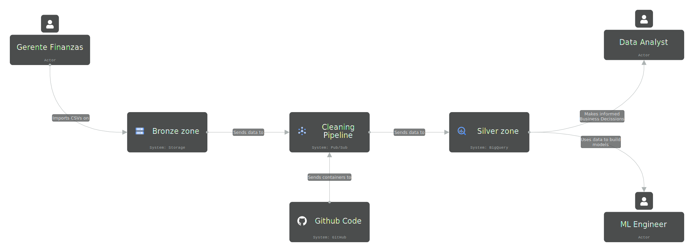
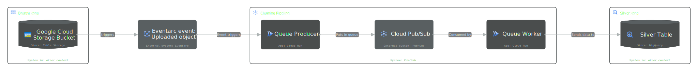
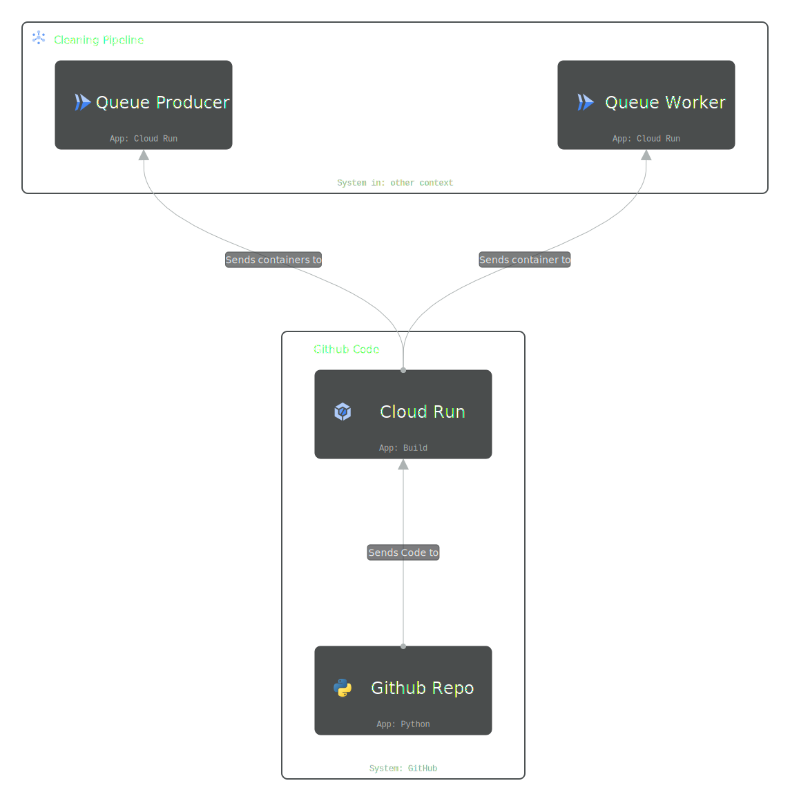

# GCP Serverless Data Ingestion Pipeline (Bronze to Silver)

An event-driven, highly decoupled, and serverless Google Cloud pipeline designed to automatically ingest raw CSV files from a "bronze" Cloud Storage landing bucket into a "silver" BigQuery dataset. Built for speed, resilience, and zero-maintenance scalability.

## 🏗 Architecture & UML Diagrams

The following UML/C4 diagrams illustrate the architecture, event flow, and code deployment strategy for this pipeline.

### 1. System Context
*The high-level flow of events from the Cloud Storage Bucket to the BigQuery Data Warehouse.*

### 2. Application Architecture
*The internal components of the cleaning pipeline, highlighting the Producer-Broker-Worker pattern.*

### 3. Code & CI/CD Context
*Repository structure and deployment flow mapping from GitHub to the GCP infrastructure.*

### 4. Data Ingestion Sequence
*A step-by-step sequence of events from the initial CSV upload by the actor to the final data load into BigQuery.*

---

## ⚙️ How It Works (The "What")

The pipeline utilizes an asynchronous, event-driven flow broken into three main stages:

1. **The Producer (`cloud_functions/producer`)**: 
   When a new CSV is uploaded to the landing Cloud Storage bucket, an HTTP trigger (via Eventarc) invokes the Producer Cloud Function. The Producer extracts the file metadata (`bucket`, `name`, `timeCreated`) and publishes this payload as a JSON message to a Pub/Sub topic (`etl--csv-input-topic`).
   
2. **The Message Broker (Cloud Pub/Sub)**: 
   Pub/Sub acts as the intermediary buffer. It receives the metadata event and pushes it to the subscribed Worker.

3. **The Worker (`cloud_functions/worker`)**: 
   Triggered via HTTP push from Pub/Sub, the Worker decodes the message. It dynamically calculates the target BigQuery table name based on the file's directory path (e.g., `landing_zone/products/products8.csv` maps to the `products` table). It then issues a direct `load_table_from_uri` job to BigQuery, appending the data to the `csv_silver_tables` dataset while allowing for automatic schema updates.

---

## 🧠 Design Rationale (The "Why")

As a cloud system designer, this architecture was chosen to prioritize **resilience, cost-efficiency, and zero-touch maintenance**:

### 1. Decoupled Architecture via Pub/Sub
Why not just have the GCS event trigger the BigQuery load directly?
* **Resilience & Retries:** If BigQuery is temporarily unavailable, or if the Worker function hits an execution timeout, the payload isn't lost. Pub/Sub will automatically retry pushing the message.
* **Separation of Concerns:** The Producer only cares about *capturing* the event. The Worker only cares about *processing* it. This makes it trivial to add new subscribers later (e.g., triggering a Slack notification or a data-quality check) without touching the ingestion logic.

### 2. Serverless Compute (Cloud Functions)
* **Cost Efficiency:** By using HTTP-triggered Cloud Functions, you only pay for the exact milliseconds the functions run. The system scales to zero during idle times and can spin up hundreds of concurrent instances during batch upload spikes. 

### 3. Pushing Compute to the Data Warehouse
* **Fast & Light:** Notice that the Worker function *does not* download the CSV, parse it line-by-line, and stream it to BigQuery. Instead, it passes a GCS URI to BigQuery and says, *"Load this."* This offloads the heavy lifting (parsing, type-inference, and loading) to BigQuery's massive distributed backend, keeping the Cloud Function executions incredibly fast, cheap, and immune to memory limits.

### 4. Dynamic Routing & Emergent Schema Evolution
* **Zero-Touch Maintenance:** The pipeline is designed to be "smart." 
    * **Dynamic Tables:** By parsing the parent folder (`path_parts[-2]`), a data engineer can create a new pipeline simply by dropping a file into a new folder. No code updates are required to map to a new table.
    * **Schema Evolution:** The inclusion of `bigquery.SchemaUpdateOption.ALLOW_FIELD_ADDITION` means that if upstream providers add new columns to their CSVs, BigQuery will seamlessly append the new columns to the table schema without breaking the pipeline.

---

## 🚀 Setup & Deployment

### Prerequisites
* Google Cloud Project (`project-64048d36-9702-43b2-805` used in Producer).
* Cloud Pub/Sub Topic: `etl--csv-input-topic`.
* BigQuery Dataset: `csv_silver_tables`.

### Dependencies
Both functions require Python 3.x and the `functions-framework==3.*`. 
* **Worker** utilizes `google-cloud-bigquery` for data loading.
* **Producer** utilizes `google-cloud-pubsub==2.*` for event messaging.

### Environment
* Ensure the service accounts running these Cloud Functions have the necessary IAM roles (`roles/pubsub.publisher` for the Producer, and `roles/bigquery.dataEditor` / `roles/storage.objectViewer` for the Worker).